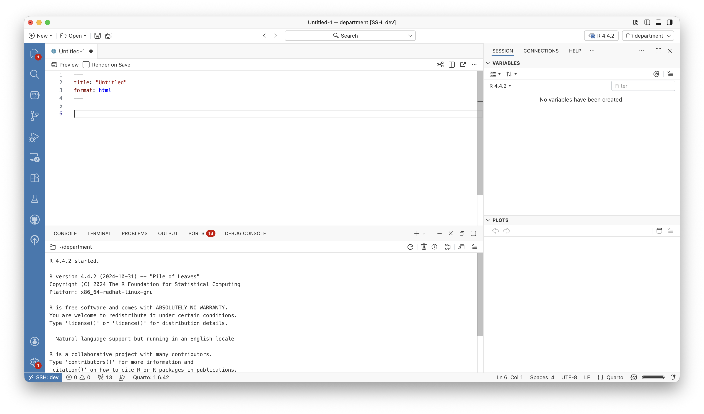
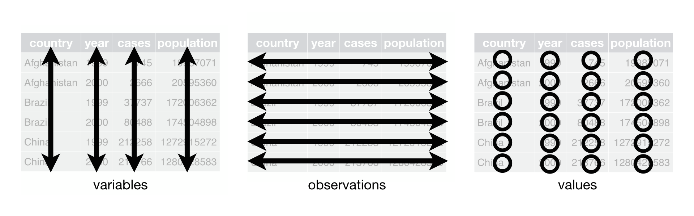

## What This Session Is (and Isn't)

This is **not** an R programming course.

. . .

You do not need to memorise anything here.

. . .

**Goal:** Build enough familiarity that when you see R code:

- You can recognise what it is doing
- You can change an input value
- You can run it and see output
- You are not intimidated by it

. . .

Think of this as learning to **read a language** well enough to follow a conversation — not to write poetry.

## The RStudio Interface


## The RStudio Interface


## A sneak peek into Positron



## Your first `code`

```{r}
#| echo: true
#| output-location: column-fragment
print("Coding for better health decisions.")
```

## Assignment {auto-animate="true"}

`<-`

```{r}
#| echo: true
#| output-location: column-fragment
text1 <- "Coding for better health decisions."
print(text1)
```

<!-- `->` -->

<!-- ```{r} -->
<!-- #| echo: true -->
<!-- #| output-location: column-fragment -->
<!-- "Hello World!" -> text2 -->
<!-- print(text2) -->
<!-- ``` -->

<!-- `=` -->

<!-- ```{r} -->
<!-- #| echo: true -->
<!-- #| output-location: column-fragment -->
<!-- text3 = "Hello World!" -->
<!-- print(text3) -->
<!-- ``` -->

## Reserved Words {auto-animate="true"}

::: columns
::: {.column width="30%"}
-   if
-   else
-   while
-   repeat
-   for
-   function
-   in
:::

::: {.column width="30%"}
-   next
-   break
-   TRUE
-   FALSE
-   NULL
-   Inf
-   NaN
:::

::: {.column width="30%"}
-   NA
-   NA_integer
-   NA_real
-   NA_complex\_
-   NA_character\_
-   …
:::
:::

# Operators

## Arithmetic {auto-animate="true"}

Addition

```{r}
#| echo: true
#| output-location: column-fragment
2 + 5
```

Subtraction

```{r}
#| echo: true
#| output-location: column-fragment
73 - 32
```

Multiplication

```{r}
#| echo: true
#| output-location: column-fragment
47 * 7
```

Division

```{r}
#| echo: true
#| output-location: column-fragment
86 / 3
```

## Arithmetic {auto-animate="true" visibility="uncounted"}

Exponentiation

```{r}
#| echo: true
#| output-location: column-fragment
8^2
```

Modulus

```{r}
#| echo: true
#| output-location: column-fragment
77%%3

```

## Relational {auto-animate="true"}

Greater

```{r}
#| echo: true
#| output-location: column-fragment
5 > 6
```

Lesser

```{r}
#| echo: true
#| output-location: column-fragment
5 < 6
```

Equal

```{r}
#| echo: true
#| output-location: column-fragment
6 == 6
```

## Relational {auto-animate="true" visibility="uncounted"}

Greater or equal

```{r}
#| echo: true
#| output-location: column-fragment
8 >= 5
```

Lesser or equal

```{r}
#| echo: true
#| output-location: column-fragment
7 <= 10
```

Not Equal

```{r}
#| echo: true
#| output-location: column-fragment
9 != 10
```

## Joining Logical

`AND`

```{r}
#| echo: true
#| output-location: column-fragment
TRUE & TRUE
```

```{r}
#| echo: true
#| output-location: column-fragment
TRUE & FALSE
```

```{r}
#| echo: true
#| output-location: column-fragment
FALSE & FALSE
```

`OR`

```{r}
#| echo: true
#| output-location: column-fragment
TRUE | TRUE
```

```{r}
#| echo: true
#| output-location: column-fragment
TRUE | FALSE
```

```{r}
#| echo: true
#| output-location: column-fragment
FALSE | FALSE
```

## Classes {auto-animate="true"}

Integer

```{r}
#| echo: true
#| output-location: column-fragment
int <- 3L
print(int)
```

```{r}
#| echo: true
#| output-location: column-fragment
class(int)
```

Numeric

```{r}
#| echo: true
#| output-location: column-fragment
num <- 4.3
print(num)
```

```{r}
#| echo: true
#| output-location: column-fragment
class(num)
```

Character

```{r}
#| echo: true
#| output-location: column-fragment
name <- "Your Name"
print(name)
```

```{r}
#| echo: true
#| output-location: column-fragment
class(name)
```

## Classes {auto-animate="true" visibility="uncounted"}

Logical

```{r}
#| echo: true
#| output-location: column-fragment
logT <- TRUE
logF <- F
print(logF)
```

```{r}
#| echo: true
#| output-location: column-fragment
class(logF)
```

Date

```{r}
#| echo: true
#| output-location: fragment
date1 <- "2023-12-18"
date2 <- 2023-12-18
date3 <- as.Date("2023-12-18")
date4 <- as.Date("18 Dec 2023","%d %b %Y")
date5 <- as.Date(45076, origin = "1900-01-01")
print(date1)
```

```{r}
#| echo: true
#| output-location: column-fragment
class(date1)
```

## Class Conversion {auto-animate="\"true"}

```{r}
#| echo: true
num <- "1"
num <- as.numeric(num)

numLet <- as.numeric(LETTERS)
charNum <- as.character(1:100)

tf <- c("TRUE","FALSE","FALSE")
tf <- as.logical(tf)

num <- as.character(num)
```

# Objects {auto-animate="true" visibility="uncounted"}

## Vectors {auto-animate="true"}

```{r}
#| echo: true
#| output-location: fragment

vec1 <- c(2,4,6,8,3,5.5)
vec2 <- 4

#combining vectors
newVec <- c(vec1,vec2)

newVec
```

```{r}
#| echo: true
#| output-location: fragment
dateVec <- c(as.Date("2023-11-28"),
             as.Date("2023-12-22"),
             Sys.Date())
dateVec
```

```{r}
#| echo: true
#| output-location: fragment
newVec[5]
```

## Matrix {auto-animate="true"}

```{r}
#| echo: true
#| output-location: column-fragment
let <- matrix(LETTERS,
              nrow = 6,
              ncol = 6,
              byrow = F)

let
```

```{r}
#| echo: true
#| output-location: column-fragment
let[3,5]
```

```{r}
#| echo: true
#| output-location: column-fragment
let[,5]
```

```{r}
#| echo: true
#| output-location: column-fragment
let[5,]
```

## Factor {auto-animate="true"}

```{r}
#| echo: true
#| output-location: fragment
gender <- c(1,2,2,1,1,1,2,2,1,2,1)

genFac <- factor(gender,
                 levels = c(1,2),
                 labels = c("Male","Female"))

genFac
```

## Data Frames {auto-animate="true"}

```{r}
#| echo: true
age <- c(12,24,NA,23,65,33) # create age vector

gender <- c("M","F","F","M","M","F") #create gender vector

occu <- factor(c(1,4,3,2,4,5), #occupation 
               levels = c(1:5),
               labels = c("Unemp","Service","Student","Business","Prof"))

#date of birth
dob <- c(as.Date("1993-01-16"),as.Date("1963-12-24"),as.Date("1971-01-05"),
         as.Date("1982-11-11"),as.Date("1984-05-15"),as.Date("1999-03-07"))

#create data frame
df <- data.frame(age,gender,occu,dob)
```

## Data Frames {auto-animate="true" visibility="uncounted"}

```{r}
#| echo: true
#| output-location: column-fragment
df
```

```{r}
#| echo: true
#| output-location: column-fragment
df[2,]
```

```{r}
#| echo: true
#| output-location: column-fragment
df[,2]
```

```{r}
#| echo: true
#| output-location: column-fragment
df[2]
```

```{r}
#| echo: true
#| output-location: column-fragment
df[2,4]
```

## List {auto-animate="true"}

```{r}
#| echo: true
#| output-location: column-fragment
list <- list(df,dob,let,newVec)

list
```

## List {auto-animate="true" visibility="uncounted"}

List with nth object(s)

```{r}
#| echo: true
#| output-location: column-fragment
list[2]
```

nth object

```{r}
#| echo: true
#| output-location: column-fragment
list[[2]]
```

selecting withing object

```{r}
#| echo: true
#| output-location: column-fragment
list[[2]][4]
```

```{r}
#| echo: true
#| output-location: column-fragment
list[[1]][2,3]
```

# Functions {auto-animate="true"}
```{r}
#| echo: true
#| eval: false
function_name(argument1 = value1, argument2 = value2, ...)
```

## Functions {auto-animate="true" visibility="uncounted"}
```{r}
#| echo: true
#| output-location: column-fragment
addition <- function(n1,n2){
  n1 + n2
}

div <- function(n1,n2){
  n1 / n2
}
```

## Functions {auto-animate="true" visibility="uncounted"}

```{r}
#| echo: true
#| output-location: column-fragment

div(n1 = 55,n2 = 3)
```

# Packages {auto-animate="true"}

```{r}
#| echo: true
#| output-location: column-fragment
library(dplyr)

dplyr::glimpse(df)
```

# Working Directory {auto-animate="true"}

``` r
setwd("~/r4ph24") #Mac, Linux, Unix

setwd("C:/user/ashwini/documents/r4ph24") #Windows

getwd()
```

# Projects {auto-animate="true"}

# Scripts {auto-animate="true"}

- Names
- Spaces
- Pipes
- Comments

## Names {auto-animate="true" visibility="uncounted"}

```{r}
#| echo: true
# Strive for:
young_age <- df %>%  filter(age < 20)

# Avoid:
YOUNGAGE <- df %>%  filter(age < 20)
```

## Spaces {auto-animate="true" visibility="uncounted"}
```{r}
#| echo: false
a = 10
b = 20
d = 4
```
```{r}
#| echo: true
# Strive for
z <- (a + b)^2 / d

# Avoid
z<-( a + b ) ^ 2/d

# Strive for
mean_age <- mean(df$age, na.rm = TRUE)

# Avoid
mean_age<-mean (df$age ,na.rm=TRUE)
```

## Pipes {auto-animate="true" visibility="uncounted"}

```{r}
#| echo: true
# Avoid
pipe <- df %>% select(age,dob,occu) %>% mutate(age_cat = if_else(age < 20,"Young","Old"))

# Strive for
pipe <- df %>%
  select(age, dob, occu) %>%
  mutate(age_cat = if_else(age < 20, "Young", "Old"))

# Avoid
pipe <- df %>%
  select(age, dob, occu) %>%
  summarise(age_cat = mean(
                            age,
                            na.rm = TRUE)
                          )

# Strive for
pipe <- df %>%
  select(age, dob, occu) %>%
  summarise(age_cat = mean(
    age,
    na.rm = TRUE)
    )
```

## Commenting {auto-animate="true"}

```{r}
#| echo: true
#| eval: false

# Print the text "Hello World"
print("Hello World!")

print("Hello World!") # Print the text "Hello World"

# Multi-line comment
# about printing the text "Hello World"
print("Hello World!")
```

##### Sections
```{r}
#| echo: true
#| eval: false
# Section 1 ####
print("Section 1")

## Sub Section ####
print("Sub section")

# Section 2 ####
print("Section 2")

```

# Importing Data {auto-animate="true"}

## CSV {auto-animate="true" visibility="uncounted"}

```{r}
#| echo: true
data <- read.csv("files/data.csv")
```

## Excel {auto-animate="true" visibility="uncounted"}

```{r}
#| echo: true
library(readxl)
data <- read_excel("files/data.xlsx")
```

## Stata, SPSS {auto-animate="true" visibility="uncounted"}

```{r}
#| echo: true
library(haven)
data <- read_sav("files/data.sav")
data <- read_dta("files/data.dta")
```

## A Swiss-Army Knife for Data I/O {auto-animate="true" visibility="uncounted"}

```{r}
#| echo: true
library(rio)
data <- rio::import("files/data.xlsx")
data <- rio::import("files/data.csv")
data <- rio::import("files/data.sav")
data <- rio::import("files/data.dta")
```

## Loops


<!-- # Tidy Data {auto-animate="true"} -->

<!-- ## Tidy Data {auto-animate="true" visibility="uncounted"} -->

<!-- 1.  Each variable is a column; each column is a variable. -->

<!-- 2.  Each observation is a row; each row is an observation. -->

<!-- 3.  Each value is a cell; each cell is a single value. -->

<!--  -->

<!-- # Getting Help {auto-animate="true"} -->

<!-- ## Help yourself {auto-animate="true" visibility="uncounted"} -->

<!-- -   Read the manual -->
<!-- -   Check your code -->
<!-- -   Read the error message -->
<!-- -   Web search -->
<!-- -   Read the forums -->
<!-- -   Rubber duck debugging -->

<!-- ## Get Help {auto-animate="true" visibility="uncounted"} -->

<!-- -   Ask a friend, colleague -->
<!-- -   Post on the forums -->
<!--     -   Describe your goal -->
<!--     -   Be explicit about your question -->
<!--     -   Provide specific information -->
<!--     -   Be courteous -->
<!--     -   Provide the solution if you found it elsewhere. -->
