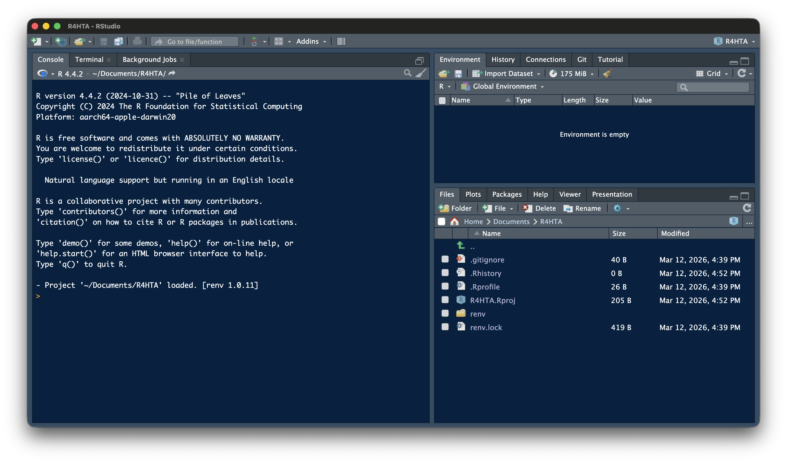
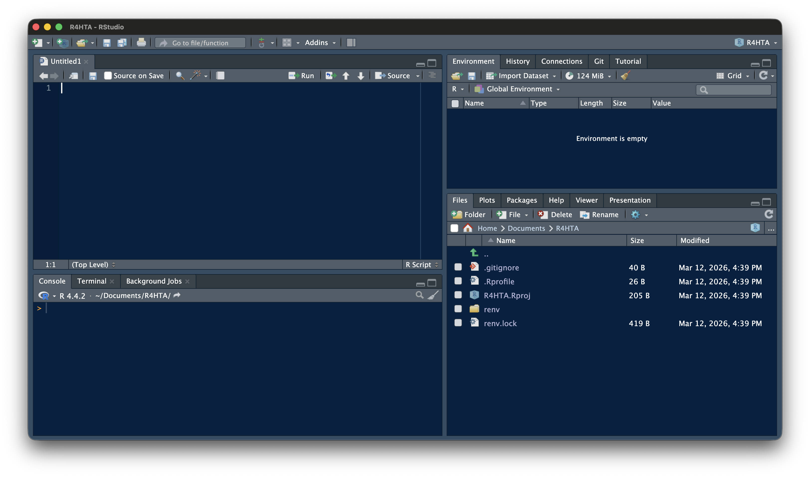
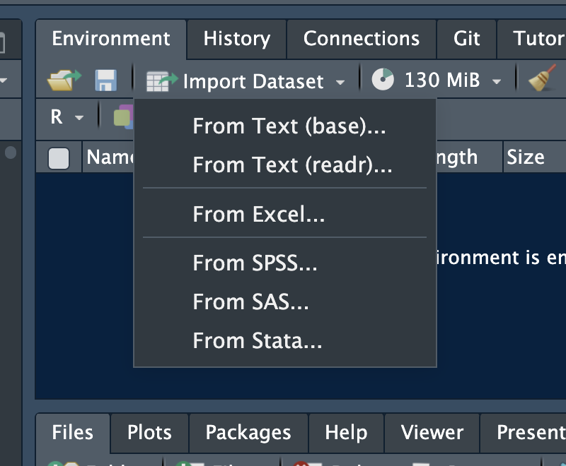

# ⚠️ Warning ⚠️ {auto-animate="true"}

This is **not** an R programming course.

# Goal {auto-animate="true"}

When you see R code:

- You are not `intimidated` by it
- You `recognise` what it is doing
- You can `run` it and see output
- You can `change` an input value

# The RStudio Interface

##  {auto-animate="true" visibility="uncounted" data-menu-title="The Rstudio Interface"}



## {auto-animate="true" visibility="uncounted" data-menu-title="The Rstudio Interface"}



# The Workflow

```{mermaid}
%%| label: fig-workflow
%%| fig-cap: The workshop workflow
flowchart LR
  A["<b><font size=6>READ</font></b><br/><font size=6>the code</font><br/><i><font size=5>(understand logic)</font></i>"]:::blue --> B["<b><font size=6>MODIFY</font></b><br/><font size=6>a parameter</font><br/><i><font size=5>(change a number)</font></i>"]:::green --> C["<b><font size=6>RUN</font></b><br/><font size=6>the chunk</font><br/><i><font size=5>(click play)</font></i>"]:::orange --> D["<b><font size=6>INTERPRET</font></b><br/><font size=6>the output</font><br/><i><font size=5>(what changed?)</font></i>"]:::red
  D -. "<b><font size=6>Try again</font></b>" .-> B

classDef blue   fill:#4e79a7,color:#fff
classDef green  fill:#59a14f,color:#fff
classDef orange fill:#f28e2b,color:#fff
classDef red    fill:#e15759,color:#fff
```

## Working with .qmd Files

All workshop materials are in **Quarto (.qmd)** files:

- **Text** — explanations
- **Code chunks** — grey blocks with R code
- **Outputs** — results, tables, plots

. . .

**To work with a .qmd file:**

1. Open it in RStudio
2. Read the text explanations
3. Run code chunks one at a time (click the green play button ▶)
4. See the output appear below each chunk
5. Modify values and re-run

# Your first `code` {auto-animate="true"}

```{r}
#| echo: true
#| output-location: fragment
print("Coding for better health decisions.")
```

# Assignment {auto-animate="true"}

Assign a `value` to a `name` with `<-`  [*(or `->`, `=`)*]{style="font-size: 0.75em; color: #888;"}

```{r}
#| echo: true
#| output-location: fragment
text <- "Coding for better health decisions."
print(text)
```


# Operators

## Arithmetic {auto-animate="true"}

Addition

```{r}
#| echo: true
#| output-location: column-fragment
2 + 5
```

Subtraction

```{r}
#| echo: true
#| output-location: column-fragment
73 - 32
```

Multiplication

```{r}
#| echo: true
#| output-location: column-fragment
47 * 7
```

Division

```{r}
#| echo: true
#| output-location: column-fragment
86 / 3
```

Exponentiation

```{r}
#| echo: true
#| output-location: column-fragment
8^2
```


## Relational {auto-animate="true"}

Greater

```{r}
#| echo: true
#| output-location: column-fragment
5 > 6
```

Less than

```{r}
#| echo: true
#| output-location: column-fragment
5 < 6
```

Equal

```{r}
#| echo: true
#| output-location: column-fragment
6 == 6
```

## Relational {auto-animate="true" visibility="uncounted"}

Greater or equal

```{r}
#| echo: true
#| output-location: column-fragment
8 >= 5
```

Less than or equal

```{r}
#| echo: true
#| output-location: column-fragment
7 <= 10
```

Not Equal

```{r}
#| echo: true
#| output-location: column-fragment
9 != 10
```


# Objects {auto-animate="true" visibility="uncounted"}

## Vectors {auto-animate="true"}

```{r}
#| echo: true
#| output-location: fragment

vec <- c(2, 4, 6, 8, 3, 5.5)

```

```{r}
#| echo: true
#| output-location: fragment
dateVec <- c(as.Date("2023-11-28"),
             as.Date("2023-12-22"),
             Sys.Date())
dateVec
```

```{r}
#| echo: true
#| output-location: fragment
vec[5]
```

## Matrix {auto-animate="true"}

```{r}
#| echo: true
#| output-location: column-fragment
mat <- matrix(1:20,
              nrow = 6,
              ncol = 6,
              byrow = F)

mat
```
. . .
```{r}
#| echo: true
#| output-location: column-fragment
mat[3,5]
```
. . .
```{r}
#| echo: true
#| output-location: column-fragment
mat[,5]
```
. . .
```{r}
#| echo: true
#| output-location: column-fragment
mat[5,]
```

## Data Frames {auto-animate="true"}

```{r}
#| echo: true
age <- c(12,24,NA,23,65,33) # create age vector

gender <- c("M","F","F","M","M","F") #create gender vector

occu <- factor(c(1,4,3,2,4,5), #occupation 
               levels = c(1:5),
               labels = c("Unemp","Service","Student","Business","Prof"))

#date of birth
dob <- c(as.Date("1993-01-16"),as.Date("1963-12-24"),as.Date("1971-01-05"),
         as.Date("1982-11-11"),as.Date("1984-05-15"),as.Date("1999-03-07"))

#create data frame
df <- data.frame(age,gender,occu,dob)
```

## Data Frames {auto-animate="true" visibility="uncounted"}

```{r}
#| echo: true
#| output-location: column-fragment
df
```

. . .

Accessing variables with `$`

```{r}
#| echo: true
#| output-location: column-fragment
df$age
```


# Functions {auto-animate="true"}
```{r}
#| echo: true
#| eval: false
function_name(argument1 = value1, argument2 = value2, ...)
```


## Functions {auto-animate="true" visibility="uncounted"}

```{r}
#| echo: true
#| output-location: column-fragment

mean(x = df$age, na.rm = TRUE)
```

# Packages {auto-animate="true"}
```{r}
#| eval: false
#| include: true
#| echo: true
install.packages("dplyr")
```

```{r}
#| echo: true
#| output-location: column-fragment
library(dplyr)

dplyr::glimpse(df)
```

. . .

Install once, load every time

# Pipes {auto-animate="true"}

`|>` or `%>%`

```{r}
#| echo: true

df |> 
  select(age, dob, occu) |> 
  summarise(
    mean_age = mean(age, na.rm = TRUE)
    )
```

# Importing Data {auto-animate="true"}

## Importing Data with GUI {auto-animate="true" visibility="uncounted"}



## Importing Data with Code {auto-animate="true" visibility="uncounted"}

CSV

```{r}
#| echo: true
data <- read.csv("files/data.csv")
```

Excel

```{r}
#| echo: true
library(readxl)
data <- read_excel("files/data.xlsx")
```

Stata, SPSS

```{r}
#| echo: true
library(haven)
data <- read_sav("files/data.sav")
data <- read_dta("files/data.dta")
```

## A Swiss-Army Knife for Data I/O {auto-animate="true" visibility="uncounted"}

```{r}
#| echo: true
library(rio)
data <- rio::import("files/data.xlsx")
data <- rio::import("files/data.csv")
data <- rio::import("files/data.sav")
data <- rio::import("files/data.dta")
```

# Loops
## For loops
```{r}
#| echo: false
library(dplyr)
data <- rio::import("files/data.csv") |> 
  mutate(bmi = round(wt/((ht/100)^2),1))
```
```{r}
#| echo: true
for (i in 1:nrow(data)) {
  bmi <- round(data$wt[i] / (((data$ht[i] / 100))^2), 2)
  cat("BMI of Record No", i, "is", bmi, "\n")
}
```

# Graphs

## ggplot

```{r}
#| echo: true
#| output-location: fragment
library(ggplot2)
ggplot(data, aes(x = ht, y = wt, colour = bmi)) +
  geom_point(size = 2) +
  labs(x = "Height", y = "Weight", title = "Height vs Weight") +
  theme_minimal()
```

## Three Things to Remember

1. **Values are stored with `<-`**
   - Change them by editing the number

. . .

2. **Code runs top to bottom**
   - Run chunks in order

. . .

3. **If something breaks, read the error message**
   - It often tells you what went wrong

Everything else you can look up — or ask an AI tool.

## Try It Yourself

```{r}
#| label: try-it
#| echo: true

# YOUR TASK: Change these values and re-run
cost_A <- 3000
cost_B <- 1500
qaly_A <- 0.82
qaly_B <- 0.75

# Calculate ICER
icer <- (cost_A - cost_B) / (qaly_A - qaly_B)
cat("ICER = ₹", round(icer, 0), "per QALY gained\n")

# Is it cost-effective?
wtp <- 100000
if (icer < wtp) {
  cat("Cost-effective at WTP = ₹", format(wtp, big.mark=",", scientific = F), "\n")
} else {
  cat("NOT cost-effective\n")
}
```